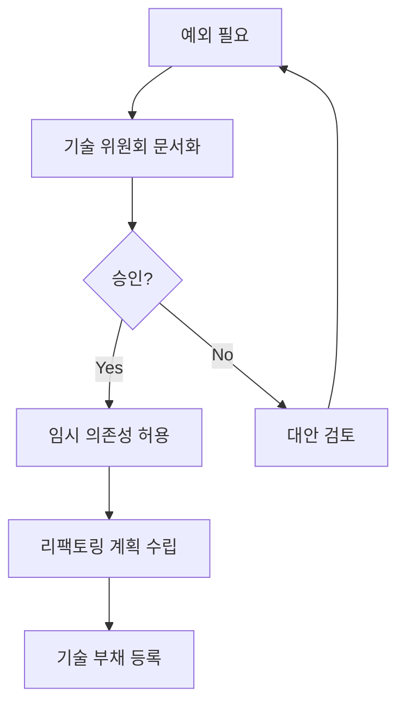

# Feature 간 의존성 관리 정책

**버전:** 1.0.0
**작성일:** 2026-01-15
**적용 대상:** 50+명의 개발자가 협업하는 대규모 Next.js 프로젝트

---

## 📋 목차

1. [개요](#개요)
2. [의존성 규칙](#의존성-규칙)
3. [허용되는 의존성](#허용되는-의존성)
4. [금지되는 의존성](#금지되는-의존성)
5. [Feature 간 통신 패턴](#feature-간-통신-패턴)
6. [예외 처리 프로세스](#예외-처리-프로세스)
7. [도구 및 검증](#도구-및-검증)
8. [모범 사례](#모범-사례)

---

## 개요

### 목적

50+명의 개발자가 동시에 작업하는 대규모 프로젝트에서 Feature 간 의존성을 체계적으로 관리하여:
- **독립성 유지**: 각 Feature가 독립적으로 개발/테스트/배포 가능
- **결합도 최소화**: Feature 간 변경 영향도 최소화
- **재사용성 극대화**: 공통 코드는 Shared Layer에서 관리
- **순환 의존성 방지**: 의존성 방향성 명확화

### 적용 범위

```
src/
├── features/        # Feature 모듈 (상호 의존성 제한)
│   ├── auth/
│   ├── dashboard/
│   └── products/
├── shared/          # 공유 계층 (모든 Feature에서 의존 가능)
└── app/            # Next.js App Router (Feature 조합)
```

---

## 의존성 규칙

### 기본 원칙

**"Feature는 다른 Feature의 구현 세부사항을 알지 못한다"**

### 의존성 방향

```
▼ 의존성 계층 구조 (위 → 아래로만 흐름)

━━━━━━━━━━━━━━━━━━━━━━━━━━━━━━━━━━━━━━━━━━━━━━━━━━━━━━━━━

[LAYER 1] app/ (Presentation Layer)
           역할: Feature 컴포넌트를 조합하여 페이지 구성
           ┃
           ┃ ✅ 의존 가능: shared, Feature Component
           ┃
           ▼
━━━━━━━━━━━━━━━━━━━━━━━━━━━━━━━━━━━━━━━━━━━━━━━━━━━━━━━━━

[LAYER 2] shared/ (Common Layer)
           역할: 모든 Feature가 공유하는 공통 코드
           내용: components, hooks, lib, types, utils
           ┃
           ┃ ✅ 의존 가능: shared 내부
           ┃ ❌ 금지: Feature 의존 불가 (순수 유지)
           ┃
           ▼
━━━━━━━━━━━━━━━━━━━━━━━━━━━━━━━━━━━━━━━━━━━━━━━━━━━━━━━━━

[LAYER 3] Feature/ (Independent Modules)
           역할: 비즈니스 기능 단위 (독립적 개발)
           예시: auth/, dashboard/, products/
           ┃
           ┃ ✅ 의존 가능: shared
           ┃ ❌ 금지: 다른 Feature 직접 import 불가
           ┃ ⚠️  예외: Redux Selector/Action만 허용
           ┃
━━━━━━━━━━━━━━━━━━━━━━━━━━━━━━━━━━━━━━━━━━━━━━━━━━━━━━━━━

금지되는 의존성 (⚠️):
  • Feature → Feature (직접 import)
  • shared → Feature (순환 의존성 위험)
  • Feature → app
```

**의존성 규칙 요약:**

```
의존성 허용 매트릭스 (From → To)

▶ shared가 의존 가능한 대상:
  • shared 내부        → ✅ 허용
  • Feature           → ❌ 금지
  • app               → N/A

▶ Feature가 의존 가능한 대상:
  • shared            → ✅ 허용 (자유롭게 import)
  • 다른 Feature      → ❌ 금지 (직접 import 불가)
                       ⚠️ 예외: Redux Selector/Action만 허용
  • app               → ❌ 금지

▶ app이 의존 가능한 대상:
  • shared            → ✅ 허용
  • Feature Component → ✅ 허용 (page.tsx, layout.tsx에서만)
  • app 내부          → N/A
```

**핵심 규칙 (3가지만 기억하세요):**

1️⃣ Feature는 shared만 의존 가능 (다른 Feature 직접 import ❌)

2️⃣ shared는 어떤 Feature도 의존 불가 (순수 유지)

3️⃣ app Page에서만 Feature Component 조합 가능

**데이터 흐름 이해:**
1. **app** → Feature 컴포넌트를 조합하여 페이지 구성
2. **shared** → 모든 Feature가 공통 코드를 재사용
3. **Feature** → 다른 Feature를 직접 import 불가 (Redux Selector만 예외)

### 핵심 규칙

1. **→ Feature → shared**: ✅ 허용
2. **→ Feature → Feature**: ❌ 금지 (직접 import)
3. **→ shared → Feature**: ❌ 금지
4. **→ app → Feature**: ✅ 허용 (Page/Layout에서만)
5. **→ app → shared**: ✅ 허용

---

## 허용되는 의존성

### ✅ 1. Feature가 Shared Layer 의존

**모든 Feature는 `src/shared/`를 자유롭게 import 가능**

```typescript
// ✅ 허용: Feature → Shared
import { Button } from '@/shared/components/ui/button';
import { useDebounce } from '@/shared/hooks/useDebounce';
import { formatDate } from '@/shared/utils/date/dateUtils';
import { ApiError } from '@/shared/types/api/error';
import { axiosInstance } from '@/shared/lib/axios/axiosInstance';
```

**Shared Layer 구조:**
```
src/shared/
├── components/      # 재사용 가능한 UI 컴포넌트
│   ├── ui/         # 기본 UI (Button, Input, etc.)
│   ├── common/     # 공통 컴포넌트 (ErrorBoundary, etc.)
│   └── layout/     # 레이아웃 컴포넌트 (Navigation, etc.)
├── hooks/          # 커스텀 훅
├── lib/            # 라이브러리 설정 (axios, etc.)
├── types/          # 공유 타입 정의
└── utils/          # 유틸리티 함수
```

### ✅ 2. Feature 간 상태 공유 (Redux 통해서만)

**Feature는 다른 Feature의 Selector/Action만 import 가능**

```typescript
// ✅ 허용: Feature → Feature (Selector/Action만)
import { selectAuthUser } from '@/features/auth/store/authSelectors';
import { logout } from '@/features/auth/store/authSlice';
import { useAppSelector } from '@/store';

// Product Feature에서 Auth 상태 사용
function ProductList() {
  const user = useAppSelector(selectAuthUser);
  const dispatch = useAppDispatch();

  const handleLogout = () => {
    dispatch(logout());
  };

  return <div>Welcome, {user?.name}</div>;
}
```

**가이드라인:**
- ✅ Redux Selector/Action import 허용
- ✅ Typed Hooks (`useAppSelector`, `useAppDispatch`) 사용 권장
- ❌ Component/Store 직접 import 금지

### ✅ 3. App Router에서 Feature 조합

**`src/app/`의 Page/Layout은 여러 Feature를 조합 가능**

```typescript
// ✅ 허용: app → features (Page에서만)
import { ProductList } from '@/features/products/components/ProductList';
import { ProductFilters } from '@/features/products/components/ProductFilters';
import { DashboardStats } from '@/features/dashboard/components/DashboardStats';

// src/app/(dashboard)/products/page.tsx
export default function ProductsPage() {
  return (
    <div>
      <DashboardStats />
      <ProductFilters />
      <ProductList />
    </div>
  );
}
```

**가이드라인:**
- ✅ Page (`page.tsx`)에서 Feature Component 조합 허용
- ✅ Layout (`layout.tsx`)에서 Navigation, Header 등 공통 UI 사용 허용
- ⚠️ 비즈니스 로직은 Page에 최소화 (Container Component 패턴 권장)

---

## 금지되는 의존성

### ❌ 1. Feature 간 Component 직접 import

```typescript
// ❌ 금지: Feature → Feature (Component)
import { ProductList } from '@/features/products/components/ProductList';
import { UserCard } from '@/features/auth/components/UserCard';

// 이렇게 하지 마세요!
function DashboardPage() {
  return (
    <div>
      <UserCard />          {/* ❌ 직접 import */}
      <ProductList />       {/* ❌ 직접 import */}
    </div>
  );
}
```

**해결 방법:**

1. **Shared Layer로 이동** (진짜 공통 컴포넌트인 경우)
```typescript
// ✅ 해결책: shared/components/business/
// src/shared/components/business/UserCard.tsx
export { UserCard };

// 사용
import { UserCard } from '@/shared/components/business/UserCard';
```

2. **Container Component 패턴** (Page에서 조합)
```typescript
// ✅ 해결책: Page에서 직접 조합
// src/app/(dashboard)/dashboard/page.tsx
import { ProductList } from '@/features/products/components/ProductList';
import { UserProfile } from '@/features/auth/components/UserProfile';

export default function DashboardPage() {
  return (
    <div>
      <UserProfile />
      <ProductList />
    </div>
  );
}
```

3. **Props Drilling** (상위 계층에서 전달)
```typescript
// ✅ 해결책: Props로 데이터 전달
function DashboardPage() {
  const user = useAppSelector(selectAuthUser);
  const products = useAppSelector(selectAllProducts);

  return (
    <DashboardContainer user={user} products={products} />
  );
}
```

### ❌ 2. Feature 간 Hook/Utility 직접 import

```typescript
// ❌ 금지: Feature → Feature (Hooks/Utils)
import { useProductFilters } from '@/features/products/hooks/useProductFilters';
import { formatPrice } from '@/features/products/utils/formatPrice';

// 이렇게 하지 마세요!
function OrderPage() {
  const filters = useProductFilters(); // ❌
  const price = formatPrice(10000);    // ❌
}
```

**해결 방법:**

1. **Shared Layer로 이동**
```typescript
// ✅ 해결책: shared/hooks/
// src/shared/hooks/useFilters.ts
export { useFilters };

// src/shared/utils/currency.ts
export { formatPrice };
```

2. **Redux Selector 사용** (상태 공유)
```typescript
// ✅ 해결책: Redux Selector 통해서 접근
import { selectFilteredProducts } from '@/features/products/store/productsSelectors';

const products = useAppSelector(selectFilteredProducts);
```

### ❌ 3. Feature 간 Type 직접 import (제한적)

```typescript
// ❌ 원칙적으로 금지
import type { Product } from '@/features/products/types/api';
import type { User } from '@/features/auth/types/store';
```

**해결 방법:**

1. **Shared Types로 이동** (여러 Feature에서 공유)
```typescript
// ✅ 해결책: shared/types/entities/
// src/shared/types/entities/
export interface User {
  id: string;
  name: string;
  email: string;
}

export interface Product {
  id: string;
  name: string;
  price: number;
}
```

2. **Redux Selector 타입 사용** (상태 타입)
```typescript
// ✅ 해결책: Selector 반환 타입 사용
import { selectAuthUser } from '@/features/auth/store/authSelectors';

// Selector의 반환 타입 자동 추론
const user = useAppSelector(selectAuthUser); // User | undefined
```

### ❌ 4. Shared Layer가 Feature 의존

**Shared Layer는 어떤 Feature도 import할 수 없음**

```typescript
// ❌ 금지: shared → feature
import { Button } from '@/features/products/components/Button';  // ❌
import { useAuth } from '@/features/auth/hooks/auth';             // ❌
```

**원칙:**
- Shared Layer는 순수(Pure)해야 함
- 어떤 Feature에도 의존하지 않아야 함
- 순환 의존성 방지

---

## Feature 간 통신 패턴

### 패턴 1: Redux를 통한 상태 공유

**사용 시나리오:** Feature 간 데이터 공유가 필요할 때

```typescript
// ✅ Product Feature에서 Auth 상태 읽기
import { useAppSelector } from '@/store';
import { selectAuthUser } from '@/features/auth/store/authSelectors';

function ProductList() {
  const user = useAppSelector(selectAuthUser);

  if (!user) {
    return <LoginPrompt />;
  }

  return <ProductTable userId={user.id} />;
}
```

### 패턴 2: URL Query Parameter 통신

**사용 시나리오:** 필터링, 검색 조건 전달

```typescript
// ✅ URL을 통한 상태 공유
// Page A에서 설정
function ProductFilters() {
  const router = useRouter();

  const handleFilterChange = (filters: Filters) => {
    router.push({
      pathname: '/products',
      query: { category: filters.category },
    });
  };
}

// Page B에서 읽기
function ProductList() {
  const searchParams = useSearchParams();
  const category = searchParams.get('category');

  const products = useProducts({ category });
}
```

### 패턴 3: Event Emitter (Custom Events)

**사용 시나리오:** 느슨한 결합의 이벤트 통신

```typescript
// ✅ Custom Event로 통신
// src/shared/utils/eventBus.ts
class EventBus {
  private events = new Map<string, Set<Function>>();

  on(event: string, callback: Function) {
    if (!this.events.has(event)) {
      this.events.set(event, new Set());
    }
    this.events.get(event)!.add(callback);
  }

  emit(event: string, data: unknown) {
    this.events.get(event)?.forEach((callback) => callback(data));
  }
}

export const eventBus = new EventBus();

// 사용: Feature A에서 이벤트 발생
import { eventBus } from '@/shared/utils/eventBus';

function LoginForm() {
  const handleLoginSuccess = (user: User) => {
    eventBus.emit('user:login', user);
  };
}

// 사용: Feature B에서 이벤트 수신
function DashboardWidget() {
  useEffect(() => {
    const handleUserLogin = (user: User) => {
      console.log('User logged in:', user);
    };

    eventBus.on('user:login', handleUserLogin);

    return () => {
      // Cleanup 필요 (EventBus 구현에 따라 다름)
    };
  }, []);
}
```

### 패턴 4: Callback/Props (부모-자식)

**사용 시나리오:** Page에서 Feature 간 데이터 흐름 제어

```typescript
// ✅ Page에서 데이터 조합
function DashboardPage() {
  const user = useAppSelector(selectAuthUser);
  const [selectedProduct, setSelectedProduct] = useState<Product | null>(null);

  return (
    <div>
      <ProductList onSelectProduct={setSelectedProduct} />
      {selectedProduct && (
        <ProductDetail productId={selectedProduct.id} userId={user?.id} />
      )}
    </div>
  );
}
```

---

## 예외 처리 프로세스

### 예외 승인 프로세스

**원칙:** 예외는 드물어야 하며, 충분한 사유가 필요

#### 1. 예외가 필요한 경우

- **기술적 제약:** 도저히 피할 수 없는 기술적 제약
- **성능 최적화:** 중복 코드 제거로 인한 성능 저하 방지
- **일관성 유지:** 전체 시스템의 일관성을 위해 필수적인 경우

#### 2. 예외 승인 절차



#### 3. 예외 문서화

**PR 템플릿:**
```markdown
## 의존성 예외 요청

### 변경 사항
- Feature: `products` → `auth`
- Import 경로: `@/features/auth/hooks/useAuth`

### 예외 사유
<!-- 구체적인 사유 설명 -->

### 대안 검토
<!-- 시도해본 대안과 문제점 -->

### 리팩토링 계획
<!-- 향후 제거 계획 -->
- 마감기한: YYYY-MM-DD
- 리팩토링 방안:

### 영향도 분석
- 영향 받는 Feature: ...
- 성능 영향: ...
- 테스트 계획: ...
```

---

## 도구 및 검증

### ESLint 규칙 (권장)

```javascript
// eslint.config.js
import importPlugin from 'eslint-plugin-import';

export default [
  {
    rules: {
      'import/no-restricted-paths': [
        'error',
        {
          zones: [
            {
              target: './src/features/**/*.ts',
              from: './src/features/**/components/**',
              except: ['./src/shared/**'],
              message: 'Feature는 다른 Feature의 Component를 직접 import할 수 없습니다. Shared Layer를 사용하세요.',
            },
            {
              target: './src/shared/**/*.ts',
              from: './src/features/**',
              message: 'Shared Layer는 Feature를 import할 수 없습니다.',
            },
          ],
        },
      ],
      'import/order': [
        'error',
        {
          groups: ['builtin', 'external', 'internal', 'parent', 'sibling', 'index'],
          alphabetize: { order: 'asc' },
          'newlines-between': 'always',
          pathGroups: [
            {
              pattern: '@/shared/**',
              group: 'internal',
              position: 'before',
            },
            {
              pattern: '@/features/**',
              group: 'internal',
              position: 'after',
            },
          ],
        },
      ],
    },
  },
];
```

### TypeScript Path Alias 활용

```json
// tsconfig.json
{
  "compilerOptions": {
    "paths": {
      "@/shared/*": ["./src/shared/*"],
      "@/features/*": ["./src/features/*"]
    }
  }
}
```

의도적인 import를 쉽게 식별 가능:
- `@/shared/` → ✅ 언제든 허용
- `@/features/` → ⚠️ 검토 필요

### 의존성 분석 도구

```bash
#madge 의존성 그래프 생성
npx madge --image dep.svg src/

# 순환 의존성 검사
npx madge --circular src/

# Feature 간 의존성 검사 스크립트
# scripts/check-dependencies.js
```

```javascript
// scripts/check-dependencies.js
const { parse } = require('typescript-eslint-parser');
const glob = require('glob');

function checkFeatureDependencies() {
  const featureFiles = glob.sync('src/features/**/*.ts');

  const violations = [];

  featureFiles.forEach((file) => {
    const content = fs.readFileSync(file, 'utf-8');
    const imports = extractImports(content);

    imports.forEach((imp) => {
      if (isFeatureToFeatureImport(imp)) {
        violations.push({
          file,
          import: imp,
          type: 'feature-to-feature',
        });
      }

      if (isSharedToFeatureImport(file, imp)) {
        violations.push({
          file,
          import: imp,
          type: 'shared-to-feature',
        });
      }
    });
  });

  return violations;
}

// CI에서 실행
const violations = checkFeatureDependencies();
if (violations.length > 0) {
  console.error('의존성 규칙 위반:', violations);
  process.exit(1);
}
```

---

## 모범 사례

### ✅ 좋은 예시

#### 1. 공통 컴포넌트 추출

```typescript
// Before: 중복 코드
// features/auth/components/Card.tsx
function AuthCard({ children }: { children: ReactNode }) {
  return <div className="card">{children}</div>;
}

// features/products/components/Card.tsx
function ProductCard({ children }: { children: ReactNode }) {
  return <div className="card">{children}</div>;
}

// After: Shared로 이동
// shared/components/ui/Card.tsx
export function Card({ children }: { children: ReactNode }) {
  return <div className="card">{children}</div>;
}

// 사용
import { Card } from '@/shared/components/ui/Card';
```

#### 2. Container Component 패턴

```typescript
// ✅ 좋은 예: Page에서 조합
// app/(dashboard)/products/page.tsx
import { ProductList } from '@/features/products/components/ProductList';
import { ProductFilters } from '@/features/products/components/ProductFilters';
import { useProducts } from '@/features/products/hooks/useProducts';

export default function ProductsPage() {
  const { products, loading } = useProducts();

  return (
    <div>
      <ProductFilters />
      <ProductList products={products} loading={loading} />
    </div>
  );
}
```

#### 3. Selector를 통한 상태 공유

```typescript
// ✅ 좋은 예: Redux Selector 사용
import { useAppSelector } from '@/store';
import { selectAuthUser } from '@/features/auth/store/authSelectors';
import { selectUserProducts } from '@/features/products/store/productsSelectors';

function UserDashboard() {
  const user = useAppSelector(selectAuthUser);
  const products = useAppSelector((state) =>
    selectUserProducts(state, user?.id)
  );

  return <DashboardWidget products={products} />;
}
```

### ❌ 나쁜 예시

#### 1. Feature 간 직접 import

```typescript
// ❌ 나쁜 예
import { ProductList } from '@/features/products/components/ProductList';

function DashboardPage() {
  return (
    <div>
      <ProductList />  {/* 직접 import */}
    </div>
  );
}
```

#### 2. Shared Layer가 Feature 의존

```typescript
// ❌ 나쁜 예: shared/components/ui/Button.tsx
import { useAuth } from '@/features/auth/hooks/useAuth';  // 순환 의존성 위험

export function Button() {
  const { user } = useAuth();
  return <button>{user?.name}</button>;
}
```

#### 3. Hook 직접 import

```typescript
// ❌ 나쁜 예
import { useProductFilters } from '@/features/products/hooks/useProductFilters';

function OrderPage() {
  const filters = useProductFilters();  // Feature 간 결합
}
```

---

## 요약

### 핵심 원칙

1. **Feature는 독립적이어야 한다** - 다른 Feature의 구현을 알 필요 없음
2. **Shared Layer는 순수해야 한다** - 어떤 Feature에도 의존하지 않음
3. **상태 공유는 Redux로** - Selector/Action만 허용
4. **Page에서 조합** - App Router가 Feature를 조합하는 역할

### 빠른 참조

| from → to | shared | feature | app |
|-----------|--------|---------|-----|
| **shared** | ✅ | ❌ | N/A |
| **feature** | ✅ | ⚠️ (Selector만) | ❌ |
| **app** | ✅ | ✅ (Component만) | N/A |

### 문의 및 승인

- **기술 위원회:** @tech-committee
- **아키텍트 팀:** @architects
- **예외 승인:** PR Template → Tech Review → Approval

---

**문서 버전:**
- v1.0.0 (2026-01-15): 초기 버전
